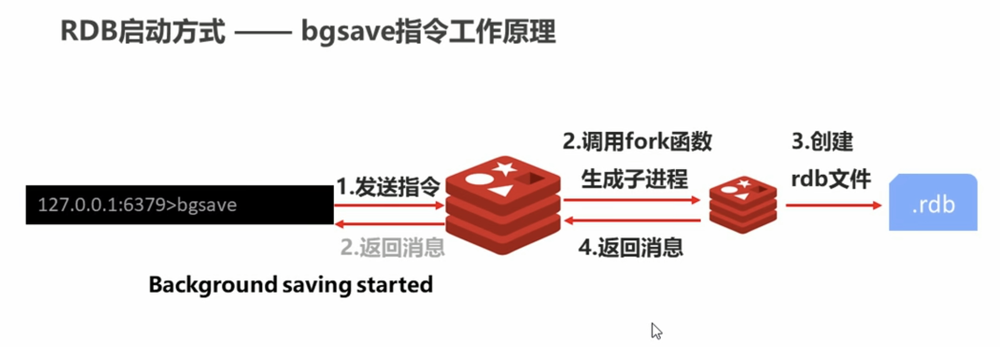
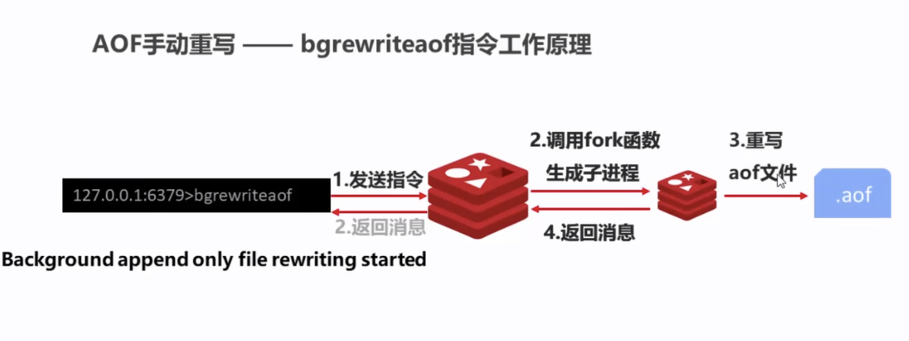
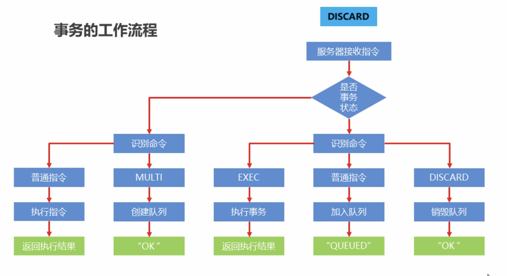
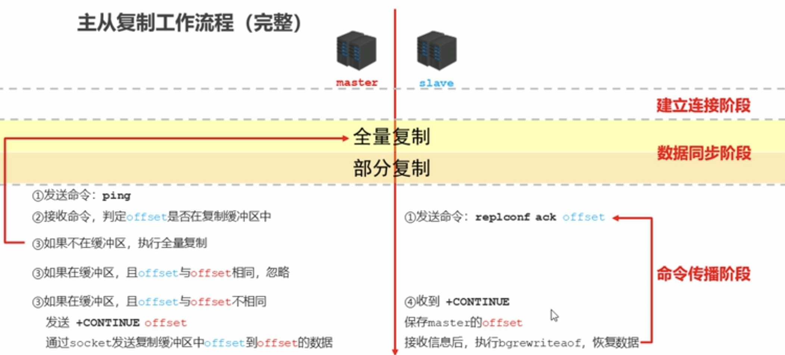
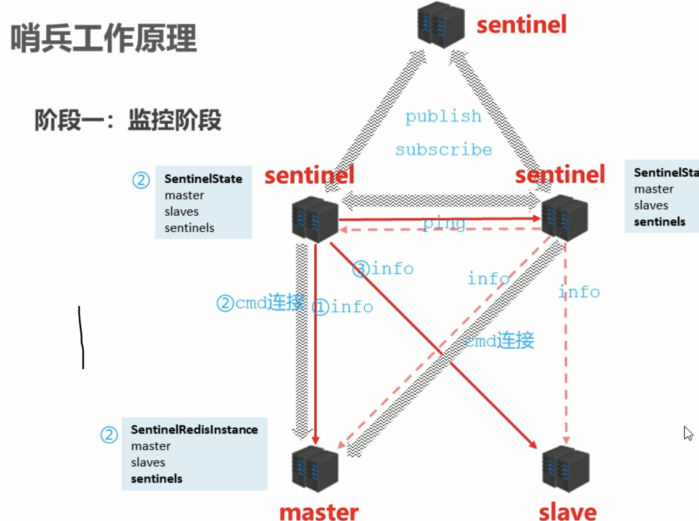
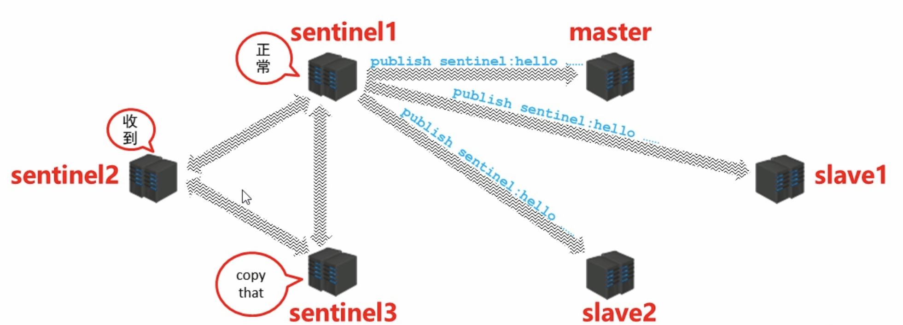
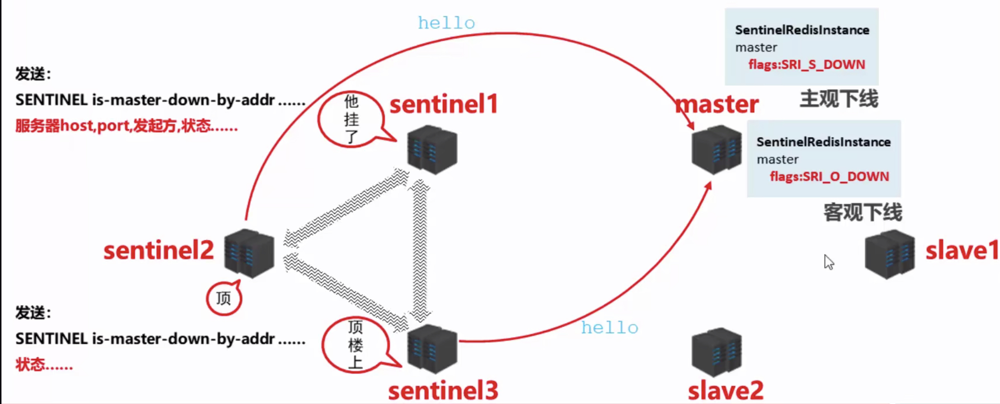
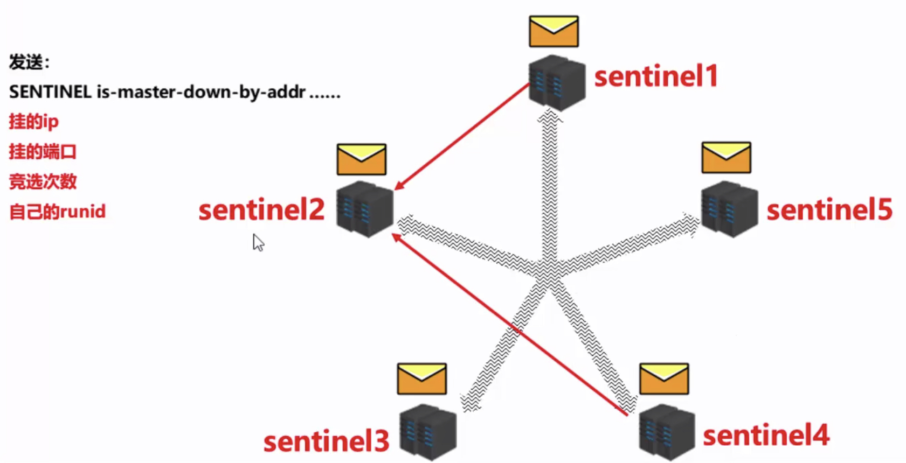

# Redis

## 持久化

利用永久性存储介质将数据进行保存，在特定的时间将保存的数据进行恢复的工作机制称为持久化。

目的：防止数据的意外丢失，确保数据安全性

- 将当前数据状态进行保存，快照形式，存储数据结果，存储格式简单，关注点在数据
- 将数据的操作过程进行保存，日志形式，存储操作过程，存储格式复杂，关注点在数据的操作过程

### RDB

- 命令

> save

- 作用

  手动执行一次保存操作

#### RDB启动方式-save指令相关配置

- dbfilename dump.rdb 设置本地数据库的文件名，默认值为dump.rdb
- dir 设置存储.rdb文件的路径
- rdbcompression yes 设置存储至本地数据库时是否压缩数据，默认yes，采用LZF压缩
- rdbchecksum yes 设置是否进行RDB文件格式校验，该校验过程在写文件和读文件过程均进行

**注意**：save指令的执行会阻塞当前redis服务器，直到当前RDB过程完成为止，有可能会造成长时间阻塞，线上环境不建议使用。

**注意**：bgsave命令是针对save阻塞问题做的优化，redis内部所有涉及RDB操作都采用bgsave的方式，save命令可以放弃使用。

- 配置

> save second changes

- 作用

  满足限定时间范围内key的变化数量达到指定数量即进行持久化

- 参数

  seconds：监控时间范围

  changes：监控key的变化量

#### RDB三种启动方式对比

| 方式           | save指令 | bgsave指令 |
| -------------- | -------- | ---------- |
| 读写           | 同步     | 异步       |
| 阻塞客户端指令 | 是       | 否         |
| 额外内存消耗   | 否       | 是         |
| 启动新进程     | 否       | 是         |

### AOF

#### RDB存储的弊端

- 存储数据量较大，效率较低
- 大数据量下的IO性能较低
- 基于fork创建子进程，内存产生额外消耗
- 宕机带来的数据丢失风险

#### AOF写数据三种策略(appendfsync)

- always
  - 每次写入操作均同步到AOF文件中，**数据零误差**，**性能较低**
- everysec
  - 每秒将缓冲区中的指令同步到AOF文件中，**数据准确性较高**，**性能较高**
  - 在系统突然宕机的情况下丢失1秒内的数据
- no (system control)
  - 由操作系统控制每次同步到AOF文件的周期，整体过程**不可控**

#### AOF重写(bgrewriteaof)

- 进程内已超时的数据不再写入文件
- 忽略无效指令，重写时使用进程内数据直接生成，这样新的AOF文件只保留最终数据的写入命令
- 对同一数据的多条命令合并为一条命令

### RDB VS AOF

| 持久化方式   | RDB                | AOF                |
| ------------ | ------------------ | ------------------ |
| 占用存储空间 | 小（数据级：压缩） | 大（指令级：重写） |
| 存储速度     | 慢                 | 快                 |
| 恢复速度     | 快                 | 慢                 |
| 数据安全性   | 会丢失数据         | 依据策略决定       |
| 资源消耗     | 高/重量级          | 低/轻量级          |
| 启动优先级   | 低                 | 高                 |

- 对数据非常敏感，建议使用默认的AOF持久化方案
- 数据呈现阶段有效性，建议使用RDB持久化方案
- 综合比对
  - RDB与AOF的选择实际上是在做一种权衡，每种都有利有弊
  - 如不能承受数分钟以内的数据丢失，对业务数据非常敏感，选用AOF
  - 如能承受数分钟以内的数据丢失，且追求大数据级的恢复速度，选用RDB
  - 灾难恢复选用RDB
  - 双保险策略，同时开启RDB和AOF，重启后，Redis优先使用AOF来恢复数据，降低丢失数据的量

## 事务(transaction)

### 简介

redis事务就是一个命令执行的队列，将一系列预定义命令包装成一个整体（一个队列）。当执行时，一次性按照添加顺序依次执行，中间不会被打断或者干扰。

一个队列中，一次性，顺序性，排他性的执行一系列命令

### 基本操作

- 开启事务

> multi

- 执行事务

> exec

注意：加入事务的命令暂时进入到任务队列中，并没有立即执行，只有执行exec命令才开始执行

- 取消事务

> discard

### 锁

- 对key添加监控锁，在执行exec前如果key发生了变化，终止事务执行

> watch key1 [key2...]

- 取消对所有key的监视

> unwatch

### 基于特定条件的事务执行-分布式锁

- 使用setnx设置一个公共锁

> setnx lock-key value

利用setnx命令的返回值特性，有值则返回设置失败，无值则返回设置成功

- 对于返回设置成功的，拥有控制权，进行下一步的具体业务操作
- 对于返回设置失败的，不具有控制权，排队或等待

操作完毕通过del操作释放锁

### 基于特定条件的事务执行-分布式锁改良

- 使用expire为锁key添加时间限定，到时不释放，放弃锁

> expire lock-key second
>
> pexpire lock-key milliseconds

## 过期数据

### 数据删除策略

1. 定时删除
2. 惰性删除
3. 定期删除

#### 定时删除

创建一个定时器，当key设置有过期时间，且过期时间到达时，由定时器任务立即执行对键的删除操作

- 优点：节约内存，到时就删除，快速释放掉不必要的内存占用
- 缺点：CPU压力很大，无论CPU此时负载量多高，均占用CPU，会影响redis服务器响应时间和指令吞吐量

#### 惰性删除

- 数据到达过期时间，不做处理。等下次访问该数据时
  - 如果未过期，返回数据
  - 发现已过期，删除，返回不存在

- 优点：节约CPU性能，发现必须删除的时候才删除
- 缺点：内存压力很大，出现长期占用内存的数据
- 总结：用存储空间换取处理器性能

#### 定期删除

- redis启动服务器初始化时，读取配置server.hz的值，默认为10
- 每秒钟执行server.hz次**serverCron() -> databasesCron() -> activeExpireCycle()**
- **activeExpireCycle()**对每个expires[*]逐一进行检测，每次执行250ms/server.hz
- 对某个expires[*]检测时，随机挑选W个key检测
  - 如果key超时，删除key
  - 如果一轮中删除的key的数量>W*25%，循环该过程
  - 如果一轮中删除的key的数量<=W*25%，检查下一个
  - W取值=ACTIVE_EXPIRE_CYCLE_LOOKUPS_PER_LOOP属性值
- 参数current_db用于记录**activeExpireCycle()**进入哪个expires[*]执行
- 如果**activeExpireCycle()**执行时间到期，下次从current_db继续向下执行

周期性轮询redis库中的时效性数据，采用随机抽取的策略，利用过期数据占比的方式控制删除频度

特点：

1. CPU性能占用设置有峰值，检测频度可自定义设置
2. 内存压力不是很大，长期占用内存的冷数据会被持续清理

总结：周期性抽查存储空间（随机抽查，重点抽查）

#### 删除策略比对

|          | 优点             | 特点2                         | 总结               |
| -------- | ---------------- | ----------------------------- | ------------------ |
| 定时删除 | 节约内存，无占用 | 不分时段占用CPU资源，频度高   | 拿时间换空间       |
| 惰性删除 | 内存占用严重     | 延时执行，CPU利用率高         | 拿空间换时间       |
| 定期删除 | 内存定期随机清理 | 每秒花费固定的CPU资源维护内存 | 随机抽查，重点抽查 |

### 数据逐出策略

- 最大可使用内存

> maxmemory

- 每次选取待删除数据的个数

> maxmemory-samples

- 删除策略

> maxmemory-policy

- 检测易失数据（可能会过期的数据集server.db[i].expires）

1. volatile-lru **LRU: Least Recently Used**
2. volatile-lfu **LFU: Least Frequently Used**
3. volatile-ttl
4. volatile-random

- 检测全库数据（所有数据集server.db[i].dict）

5. alleys-lru
6. alleys-lfu
7. alleys-random

- 放弃数据驱逐

8. no-enviction（驱逐）：禁止驱逐数据，会引发错误OOM (Out Of Memory)

## 主从复制

### 简介

- 高并发
- 高性能
- 高可用

主从复制即将master中的数据即时有效地复制到slave中

特征：一个master可以拥有多个slave，一个slave只对应一个master

职责：

- master：
  - 写数据
  - 执行写操作时，将出现变化的数据自动同步到slave
  - 读数据（可忽略）
- slave：
  - 读数据
  - 写数据（禁止）

**主从复制的作用**

- 读写分离：master写，slave读，提高服务器的读写负载能力
- 负载均衡：基于主从结构，配合读写分离，由slave分担master负载，并根据需求的变化，改变slave的数量，通过多个从节点分担数据读取负载，大大提高Redis服务器并发量与数据吞吐量
- 故障恢复：当master出现问题时，由slave提供服务，实现快速的故障恢复
- 数据冗余：实现数据热备份，是持久化之外的一种数据冗余方式
- 高可用基石：基于主从复制，构建哨兵模式和集群，实现Redis的高可用方案

### 主从复制工作流程

#### 总述

- 主从复制过程大体分为3个阶段
  - 建立连接阶段（即准备阶段）
  - 数据同步阶段
  - 命令传播阶段

#### 阶段一：建立连接阶段

- 建立slave到master的连接，使master能够识别slave，并保存slave端口号
  - 设置master的地址和端口，保存master信息
  - 建立socket连接
  - 发送ping命令（定时器任务）
  - 身份验证
  - 发送slave端口信息

主从连接（slave连接master）

- 方式一：客户端发送命令 `slaveof <masterip> <masterport>`
- 方式二：启动服务器参数 `redis-server --slaveof <masterip> <masterport>`
- 方式三：服务器配置 `slaveof <masterip> <masterport>`

#### 阶段二：数据同步阶段

- 在slave初次连接master后，复制master中的所有数据到slave
- 将slave的数据库状态更新成master当前的数据库状态
  - 请求同步数据
  - 创建RDB同步数据
  - 恢复RDB同步数据
  - 请求部分同步数据
  - 恢复部分同步数据

#### 阶段三：命令传播阶段

- 当master数据库状态被修改后，导致主从服务器数据库状态不一致，此时需要让主从数据同步到一致的状态，同步的动作成为命令传播
- master将接收到的数据变更命令发送给slave，slave接受命令后执行命令

**命令传播阶段的部分复制**

- 命令传播阶段出现了断网现象
  - 网络闪断闪连      忽略
  - 短时间网络中断  部分复制
  - 长时间网络中断  全量复制

- 部分复制的三个核心要素
  - 服务器的运行id（run id）
  - 主服务器的复制积压缓冲区
  - 主从服务器的复制偏移量

进入命令传播阶段后，master与slave间需要进行信息交换，使用心跳机制进行维护，实现双方连接保持在线

- master心跳
  - 指令：PING
  - 周期：由repl-ping-slave-period决定，默认10秒
  - 作用：判断slave是否在线
  - 查询：INFO replication 获取slave最后一次连接时间间隔，lag项维持在0或1视为正常
- slave心跳
  - 指令：REPLCONF ACK{offset}
  - 周期：1秒
  - 作用1：汇报slave自己的复制偏移量，获取最新的数据变更指令
  - 作用2：判断master是否在线

#### 完整流程

## 哨兵模式

### 主机宕机

- 将宕机的master下线
- 找一个slave作为master
- 通知所有的slave连接新的master
- 启动新的master与slave
- (全量复制 + 部分复制)*N

哨兵(sentinel)是一个分布式系统，用于对主从结构中的每台服务器进行**监控**，当出现故障时通过投票机制**选择**新的master并将所有slave连接到新的master。

### 哨兵的作用

- 监控
  - 不断的检查master和slave是否正常运行
  - master存活检测，master与slave运行情况检测
- 通知（提醒）
  - 当被监控的服务器出现问题时，向其他（哨兵间，客户端）发送通知
- 自动故障转移
  - 断开master与slave连接，选取一个slave作为master，将其他slave连接到新的master，并告知客户端新的服务器地址

注意：

1. 哨兵也是一台redis服务器，只是不提供数据服务
2. 通常哨兵配置数量为单数

### 哨兵工作原理

- 哨兵在进行主从切换过程中经历三个阶段
  - 监控
  - 通知
  - 故障转移

#### 阶段一：监控阶段

- 用于同步各个节点的状态信息
  - 获取各个sentinel的状态（是否在线）
  - 获取master的状态
  - 获取所有slave的状态（根据master中的slave信息）

#### 阶段二：通知阶段

#### 阶段三：故障转移阶段

- 服务器列表中挑选备选master
  - 不在线的
  - 响应慢的
  - 与原master断开时间久的
  - 优先原则
    - 优先级
    - offset
    - runid
- 发送指令（sentinel）
  - 向新的master发送slaveof no one
  - 向其他slave发送slaveof新masterIP端口

#### 总结

- 监控
  - 同步信息
- 通知
  - 保持联通
- 故障转移
  - 发现问题
  - 竞选负责人
  - 优选新master
  - 新master上任，其他slave切换master，原master作为slave故障回复后连接

## 集群

### 集群简介

- 集群就是使用网络将若干台计算机联通起来，并提供统一的管理方式，使其对外呈现单机的服务效果

**集群作用**

- 分散单机服务器的访问压力，实现负载均衡
- 分散单机服务器的存储压力，实现可扩展性
- 降低单台服务器宕机带来的业务灾难

### 集群结构

**数据存储设计**

- 通过算法设计，计算出key应该保存的位置
- 将所有的存储空间计划切割成16384份，每台主机保存一部分
  - 每份代表的是一个存储空间，不是一个key的保存空间
- 将key按照计算出的结果放到对应的存储空间
- 增强可扩展性（槽）

**集群内部通讯设计**

- 各个数据库相互通信，保存各个库中槽的编号数据
- 一次命中，直接返回
- 一次未命中，告知具体位置（最多两次命中）

## 企业级解决方案

### 缓存预热

#### 问题排查

1. 请求数量较高
2. 主从之间数据吞吐量较大，数据同步操作频率较高

#### 解决方案

**前期准备工作**：

1. 日常例行统计数据访问记录，统计访问频度较高的热点数据
2. 利用LRU数据删除策略，构建数据留存队列（例如：storm与kafka配合）

**准备工作**：

1. 将统计结果中的数据分类，根据级别，redis优先加载级别较高的热点数据
2. 利用分布式多服务器同时进行数据读取，提速数据加载过程

**实施**：

1. 使用脚本程序固定触发数据预热过程
2. 如果条件允许，使用CDN（内容分发网络），效果会更好

#### 总结

缓存预热就是系统启动前，提前将相关的缓存数据直接加载到缓存系统，避免在用户请求的时候，先查询数据库，然后再将数据缓存的问题。用户可直接查询实现被预热的缓存数据。

### 缓存雪崩

#### 问题排查

1. 在一个**较短**的时间内，缓存中**较多**的key**集中过期**
2. 此周期内请求访问过期的数据，redis未命中，redis向数据库获取数据
3. 数据库同时接收到大量的请求无法及时处理
4. redis大量请求被积压，开始出现超时现象
5. 数据库流量激增，数据库崩溃
6. 重启后仍然面对缓存中无数据可用
7. redis服务器资源被严重占用，redis服务器崩溃
8. redis集群呈现崩溃，集群瓦解
9. 应用服务器无法及时得到数据相应请求，来自客户端的请求数量越来越多，应用服务器崩溃
10. 应用服务器，redis，数据库全部重启，效果不理想

#### 解决方案（道）

1. 更多的页面静态化处理
2. 构建多级缓存架构（Nginx缓存 + redis缓存 + ehcache缓存)
3. 检测Mysql严重耗时业务进行优化（对数据库的瓶颈排查：例如超时查询，耗时较高事务等）
4. 灾难预警机制（监控redis服务器性能指标，如CPU占用，CPU使用率，内存容量，查询平均响应时间，线程数）
5. 限流，降级（短时间范围内牺牲一些客户体验，限制一部分请求访问，降低应用服务器压力，待业务低速运转后再逐步放开访问）

#### 解决方案（术）

1. LRU与LFU切换
2. 数据有效期策略调整
3. 超热数据使用永久key
4. 定期维护（自动+人工）
5. 加锁（慎用！）

#### 总结

缓存雪崩就是瞬间过期数据量太大，导致对数据库服务器造成压力。如能够有效避免过期时间集中，可以有效解决雪崩现象的出现（约40%），配合其他策略一起使用，并监控服务器的运行数据，根据运行记录做快速调整。

### 缓存击穿

#### 问题排查

1. redis中某个key过期，该key访问量巨大
2. 多个数据请求从服务器直接压到redis后，均未命中
3. redis在短时间内发起了大量对数据库中同一数据的访问

#### 解决方案（术）

1. 预先设定
2. 现场调整
3. 后台刷新数据
4. 二级缓存
5. 加锁

#### 总结

缓存击穿就是单个高热数据过期的瞬间，数据访问量较大，未命中redis后，发起了大量对同一数据的数据库访问，导致对数据库服务器造成压力。应对策略应该在业务数据分析和预防方面进行，配合运行监控测试与即时调整策略，毕竟单个key的过期监控难度较高，配合雪崩处理策略即可。

### 缓存穿透

#### 问题排查

1. redis中大面积出现未命中
2. 出现非正常URL访问

#### 解决方案（术）

1. 缓存null
2. 白名单策略
3. 实时监控
4. key加密

#### 总结

缓存穿透访问了不存在的数据，跳过了合法数据的redis数据缓存阶段，每次访问数据库，导致对数据库服务器造成压力。

无论是黑名单还是白名单，都是对整体系统的压力，警报解除后尽快移除。

### 性能指标监控

- 性能指标：performance
- 内存指标：memory
- 基本活动指标：basic activity
- 持久性指标：persistence
- 错误指标：error